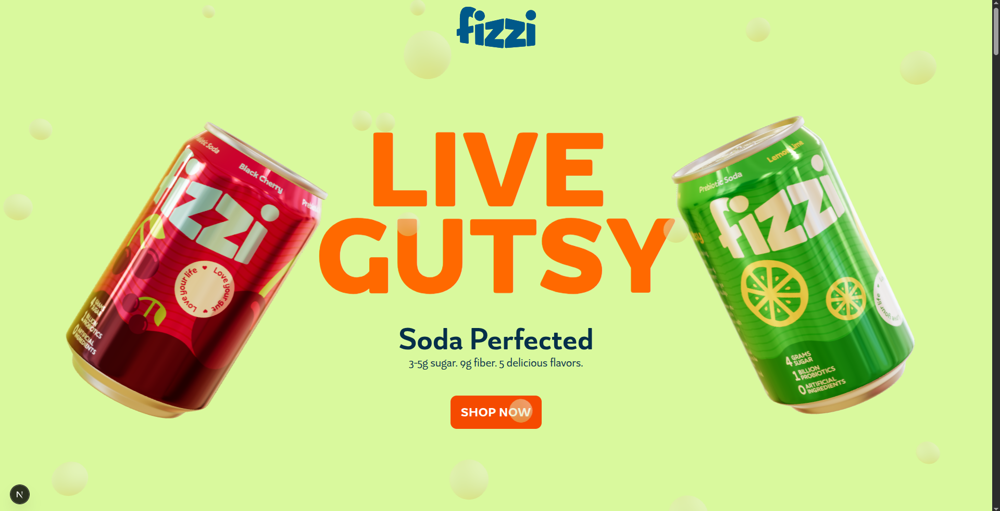

# 3D Interactive Soda Can Visualizer

An interactive web application showcasing **3D soda can models** with various flavor designs. Built with **React Three Fiber** and **Next.js**, this project enables users to explore realistic 3D soda cans in a responsive and visually engaging way.



## 🚀 Features

- **Interactive 3D soda cans:** Users can rotate, zoom, and interact with photorealistic soda can models.
- **Multiple flavor designs:** Browse through different soda flavor can designs.
- **Responsive design:** Ensures seamless visuals across all devices.
- **Smooth animations:** Transitions powered by GSAP for an immersive experience.
- **Custom font support:** Integrated custom typography for a unique visual appeal.

## 🛠️ Technologies Used

This project leverages the latest technologies for modern web development:

- **[Next.js](https://nextjs.org/)** 15.2 for server-side rendering and optimized performance.
- **[React](https://reactjs.org/)** 19.0 as the core UI library.
- **[React Three Fiber](https://docs.pmnd.rs/react-three-fiber)** for rendering advanced 3D graphics.
- **[Three.js](https://threejs.org/)** framework for creating 3D visualizations.
- **[GSAP (GreenSock)](https://greensock.com)** for smooth animations.
- **[TailwindCSS](https://tailwindcss.com/)** for modern and flexible styling.
- **[Prismic CMS](https://prismic.io/)** for managing and serving content dynamically.
- **TypeScript** for static typing and improved development experience.


## 📋 Prerequisites

Before setting up the project, ensure the following software is installed:

- **[Node.js](https://nodejs.org/)** 18.0 or higher
- **npm** (Node Package Manager)

## 💾 Installation

Follow these steps to set up the project locally:

1. Clone the repository:
   ```bash
   git clone https://github.com/username/fizzidavi.git
   ```
2. Navigate into the project folder:
   ```bash
   cd fizzidavi
   ```
3. Install dependencies:
   ```bash
   npm install
   ```

## 🚀 Running the Application

Start the development server:


The application will be available at `http://localhost:3000`.

## 🖼️ Deploying

To build the project for production deployment, run:


## 📦 Scripts

The project includes the following npm scripts:

- `dev`: Start the development server
- `build`: Build the project for production
- `start`: Start the production server

## ✍️ Author

Developed by **Davi Pereira**. Feel free to reach out at [your-email@example.com](mailto:your-email@example.com).

---

Happy coding! 🎉
